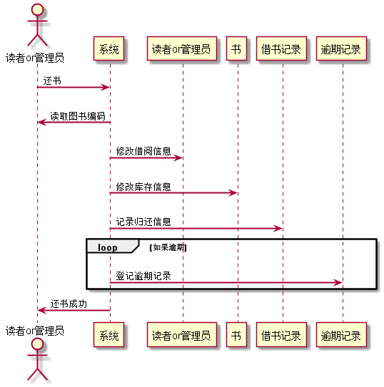
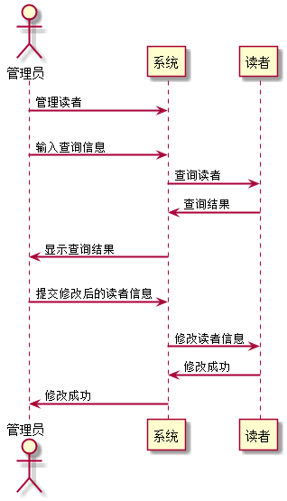
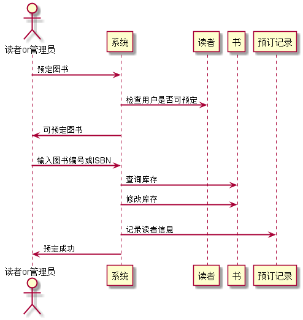

# 实验四：图书管理系统顺序图绘制
<table>
<tr>
<td>学号</td>
<td>班级</td>
<td>姓名</td>
<td>照片</td>
</tr>
<tr>
<td>201510414304</td>
<td>15软件三班</td>
<td>胡海龙</td>
<td>暂无</td>
</tr>
</table>

### 1.借书用例

1.1 PlantUml源码如下：
```
@startuml
skinparam sequenceArrowThickness 2
skinparam maxmessagesize 60

actor "读者or管理员" as U
participant "系统" as A
participant "读者or管理员" as B
participant "书" as C
participant "借书记录" as D

U -> A: 图书编号或ISBN
A -> B: 检查是否可借
A -> C: 查询库存
C-> A: 返回库存
A -> C: 修改库存
A -> D: 创建借书记录
A -> U: 成功借出图书
@enduml
```
1.2 借书用例顺序图


1.3 借书用例顺序图说明

借书用例顺序图参与者有两种，分别为读者或管理员，参与者输入要借的图书信息，系统检测用户状态是否
可借出图书与图书库存是否有剩余，若均满足条件，则修改库存，创建借书记录，成功借出图书。

### 2.查询图书用例

2.1 PlantUml源码
```
@startuml
skinparam sequenceArrowThickness 2
skinparam maxmessagesize 60

actor "读者or管理员" as U
participant "系统" as A
participant "书" as C

U -> A: 输入ISBN或书名
A -> C: 查询图书信息
C-> A: 返回查询信息
A -> U: 输出查询结果
@enduml
```

2.2 查询图书用例顺序图


2.3 查询图书用例顺序图说明

查询图书用例顺序图的参与者分别为读者或者管理员，用户发起查询请求，输入查询信息，系统根据信息查询
书籍信息，并输出查询结果。

### 3.还书用例

3.1 PlantUml源码如下：

```
@startuml
skinparam sequenceArrowThickness 2
skinparam maxmessagesize 60

actor "读者or管理员" as U
participant "系统" as A
participant "读者or管理员" as B
participant "书" as C
participant "借书记录" as D
participant "逾期记录" as E

U -> A: 还书
A->U:读取图书编码
A -> B: 修改借阅信息
A -> C: 修改库存信息
A -> D: 记录归还信息
loop 如果逾期
A-> E:登记逾期记录
end
A->U:还书成功
@enduml
```

3.2 还书用例顺序图



3.3 还书用例顺序图说明

借书用例顺序图参与者分别为读者或管理员，用户发起还书请求，根据系统提示将书籍条形码置于扫描区，
系统扫描编号和书籍是够完好，然后修改用户借阅信息，修改图书库存信息，记录归还信息，判断是否逾期，
逾期则添加进逾期记录，还书成功。

### 4.管理读者信息用例

4.1 PlantUml源码如下:
```
@startuml
skinparam sequenceArrowThickness 2
skinparam maxmessagesize 60

actor 管理员 as U
participant "系统" as A
participant "读者" as B

U->A:管理读者
U->A:输入查询信息
A->B:查询读者
B->A:查询结果
A->U:显示查询结果
U->A:提交修改后的读者信息
A->B:修改读者信息
B->A:修改成功
A->U:修改成功
@enduml
``` 

4.2 管理读者信息用例顺序图



4.3 管理读者信息用例顺序图说明

管理读者信息用例顺序图的参与者为管理员，管理员发起管理读者请求，并输入查询信息，系统根据查询信息查找读者，
并返回结果，管理员修改需要修改的信息并提交，系统修改读者信息，返回修改成功信息。

### 5.预定图书用例

5.1 PlantUml源码如下：

```
@startuml
skinparam sequenceArrowThickness 2
skinparam maxmessagesize 60

actor "读者or管理员" as U
participant "系统" as A
participant "读者" as B
participant "书" as C
participant "预订记录" as D

U->A:预定图书
A -> B: 检查用户是否可预定
A->U:可预定图书
U -> A: 输入图书编号或ISBN
A -> C: 查询库存
A -> C: 修改库存
A -> D: 记录读者信息
A -> U: 预定成功
@enduml
```
5.2 预定图书用例顺序图



5.3 预定图书用例顺序图说明

预定图书用例顺序图参与者为管理员或者读者，用户发起预定请求，系统检测用户状态是否可预定图书，
用户输入图书信息，系统检测书籍库存，若可预定，则修改库存，添加预定记录，返回预定成功信息。