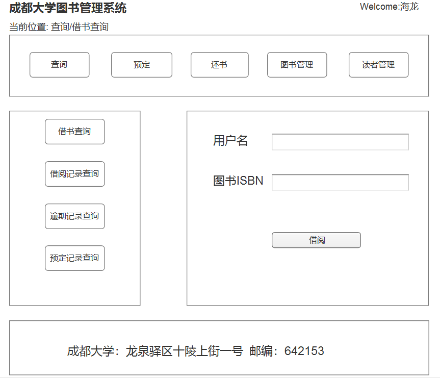

# 实验五：图书管理系统数据库设计与界面设计
<table>
<tr>
<td>学号</td>
<td>班级</td>
<td>姓名</td>
<td>照片</td>
</tr>
<tr>
<td>201510414304</td>
<td>15软件三班</td>
<td>胡海龙</td>
<td>暂无</td>
</tr>
</table>

### 1.数据表设计

1.1 tb_collection(馆藏资源表)
<table>
<tr>
<td> 名</td> <td>类型</td> <td> 长度</td> <td>小数点 </td> <td> 允许空值</td> <td> 主键</td><td> 说明</td>
</tr>
<tr>
<td>resource_name</td><td>varchar</td> <td> 20</td> <td> 0</td> <td>否 </td> <td> 否</td><td> 资源名</td>
<tr>
<tr>
<td>resource_ISBN</td><td>varchar </td> <td>13 </td> <td>0 </td> <td> 否</td> <td>是 </td><td> 资源ISBN</td>
<tr>
<tr>
<td>resource_price</td><td> double</td> <td>6 </td> <td>1 </td> <td> 否</td> <td>否 </td><td> 价格</td>
<tr>
<tr>
<td>resource_cnum</td><td> int</td> <td>4 </td> <td>0 </td> <td>否 </td> <td> 否</td><td> 复本量</td>
<tr>
<tr>
<td>resource_snum</td><td> int</td> <td>4 </td> <td> 0</td> <td> 否</td> <td>否 </td><td> 库存量</td>
<tr>
<tr>
<td>resource_summary</td><td>varchar </td> <td> 40</td> <td> 0</td> <td> 是</td> <td> 否</td><td> 简介</td>
<tr>
</table>

1.2 tb_resource(资源项)

<table>
<tr>
<td> 名</td> <td>类型</td> <td> 长度</td> <td>小数点 </td> <td> 允许空值</td> <td> 主键</td><td> 说明</td>
</tr>

<tr>
<td> resource_id</td> <td>int</td> <td> 20</td> <td>0 </td> <td> 否</td> <td> 是</td><td> 馆藏流水号，自增</td>
</tr>
<tr>
<td> resource_ISBN</td> <td>varchar</td> <td> 13</td> <td>0 </td> <td> 否</td> <td> 外键</td><td> 馆藏资源ISBN，
tb_collection的外键</td>
</tr>
<tr>
<td> resource_status</td> <td>int</td> <td> 1</td> <td>0 </td> <td> 否</td> <td> 否</td><td> 状态，默认为0(0：表示在馆，
1：表示借出)</td>
</tr>

</table>


1.3 tb_book(图书表)

<table>

<tr>
<td> 名</td> <td>类型</td> <td> 长度</td> <td>小数点 </td> <td> 允许空值</td> <td> 主键</td><td> 说明</td>
</tr>

<tr>
<td> book_id</td> <td>int</td> <td> 20</td> <td>0 </td> <td> 否</td> <td> 是</td><td> 图书ID，自增主键</td>
</tr>

<tr>
<td> book_ISBN</td> <td>varchar</td> <td> 13</td> <td>0</td> <td> 否</td> <td> 外键</td><td> 图书ISBN，tb_collection的外键</td>
</tr>
<tr>
<td> book_author</td> <td>varchar</td> <td> 13</td> <td>0 </td> <td> 否</td> <td> 否</td><td> 作者</td>
</tr>
<tr>
<td> book_publisher</td> <td>varchar</td> <td> 20</td> <td>0 </td> <td>否</td> <td> 否</td><td> 出版社</td>
</tr>
<tr>
<td> book_publish_time</td> <td>date</td> <td> 20</td> <td>0 </td> <td> 是</td> <td> 否</td><td> 出版时间</td>
</tr>
<tr>
</table>


1.4 tb_user(用户表)

<table>
<tr>
<td> 名</td> <td>类型</td> <td> 长度</td> <td>小数点 </td> <td> 允许空值</td> <td> 主键</td><td> 说明</td>
</tr>

<tr>
<td> user_id</td> <td>int</td> <td> 12</td> <td>0 </td> <td> 否</td> <td> 否</td><td> 用户ID，自增</td>
</tr>

<tr>
<td> user_name</td> <td>varchar</td> <td> 10</td> <td>0 </td> <td> 否</td> <td> 是</td><td> 用户名，唯一索引</td>
</tr>
<tr>
<td> user_password</td> <td>varchar</td> <td> 16</td> <td>0</td> <td> 否</td> <td> 否</td><td> 密码</td>
</tr>

<tr>
<td> user_role</td> <td>int</td> <td> 1</td> <td>0</td> <td> 否</td> <td> 否</td><td> 角色,(默认为1,1：表示普通用户，
2：表示管理员用户)</td>
</tr>

<tr>
<td> user_id_num</td> <td>varchar</td> <td> 22</td> <td>0 </td> <td> 否</td> <td> 否</td><td> 借阅证号</td>
</tr>

<tr>
<td> user_snum</td> <td>int</td> <td> 2</td> <td>0 </td> <td> 否</td> <td> 否</td><td> 可借数量</td>
</tr>
<tr>
<td> user_cnum</td> <td>int</td> <td> 2</td> <td>0 </td> <td> 是</td> <td> 否</td><td> 最大可借数量</td>
</tr>
</table>

1.5 tb_lend(借阅表)

<table>

<tr>
<td> 名</td> <td>类型</td> <td> 长度</td> <td>小数点 </td> <td> 允许空值</td> <td> 主键</td><td> 主键</td>
</tr>

<tr>
<td> lend_id</td> <td>int</td> <td> 16</td> <td>0 </td> <td> 否</td> <td> 是</td><td> 借阅记录ID</td>
</tr>
<tr>
<td> lend_user_name</td> <td>varchar</td> <td> 10</td> <td>0 </td> <td> 否</td> <td> 外键</td><td> 借阅者用户名，
tb_user表的外键</td>
</tr>
<tr>
<td> lend_resource_ISBN</td> <td>varchar</td> <td> 13</td> <td>0 </td> <td> 否</td> <td> 外键</td><td> 借阅资源ISBN</td>
</tr>
<tr>
<td> lend_time</td> <td>date</td> <td> 18</td> <td>0 </td> <td> 否</td> <td> 否</td><td> 借阅时间</td>
</tr>
<tr>
<td> return_time</td> <td>date</td> <td> 18</td> <td>0</td> <td> 是</td> <td> 否</td><td> 还书时间</td>
</tr>
</table>


1.6 tb_passtime(逾期表)

<table>

<tr>
<td> 名</td> <td>类型</td> <td> 长度</td> <td>小数点 </td> <td> 允许空值</td> <td> 主键</td><td> 说明</td>
</tr>

<tr>
<td> pass_id</td> <td>int</td> <td> 10</td> <td>0 </td> <td> 否</td> <td> 主键</td><td>逾期记录ID</td>
</tr>

<tr>
<td> lend_id</td> <td>int</td> <td> 16</td> <td>0 </td> <td> 否</td> <td> 外键</td><td>逾期借阅信息ID，tb_lend的外键</td>
</tr>

</table>

1.7 tb_reserve(预定表)

<table>

<tr>
<td> 名</td> <td>类型</td> <td> 长度</td> <td>小数点 </td> <td> 允许空值</td> <td> 主键</td><td> 说明</td>
</tr>

<tr>
<td> reserve_id</td> <td>int</td> <td> 16</td> <td>16</td> <td> 否</td> <td> 是</td><td> 预定记录ID</td>
</tr>

<tr>
<td> resource_ISBN</td> <td>varchar</td> <td> 13</td> <td>0 </td> <td> 否</td> <td> 外键</td><td> 预定资源ISBN，tb_collection
的外键</td>
</tr>

<tr>
<td> user_name</td> <td>varchar</td> <td> 10</td> <td>0 </td> <td> 否</td> <td> 外键</td><td> 预定用户名,tb_user的
外键</td>
</tr>
<tr>
<td> lend_time</td> <td>date</td> <td> 18</td> <td>0 </td> <td> 否</td> <td> 否</td><td> 预定时间</td>
</tr>
</table>

### 2.界面设计





### 3.接口设计


3.1 获取用户借阅信息(从数据库获取)
请求地址：http://hailong.com/bookmanage/user_name  
请求方法：GET  
请求参数:  
<table>
<tr>
<td>参数名称</td><td>必填</td><td>说明</td>
</tr>

<tr>
<td>userName</td><td>是</td><td>用户名</td>
</tr>

<tr>
<td>action</td><td>是</td><td>getLendInfo</td>
</tr>

<tr>
<td>access_token</td><td>是</td><td>验证输入的合法性</td>
</tr>

<tr>
<td>method</td><td>是</td><td>GET</td>
</tr>
</table>

返回示例:  
```
{
    "info":"查询成功",
    "data":{ 
        "lendId":"1",
        "userName":"海龙",
        "bookISBN":"979-987-432-243-3",
        "lendTime":"2018-05-03"
    },
    "code":200
}
```
返回参数说明:  
<table>

<tr>
<td>参数名称</td><td>说明</td>
</tr>

<tr>
<td>Info</td><td>返回操作信息</td>
</tr>

<tr>
<td>data</td><td>返回数据</td>
</tr>

<tr>
<td>code</td><td>返回码</td>
</tr>
</table>


