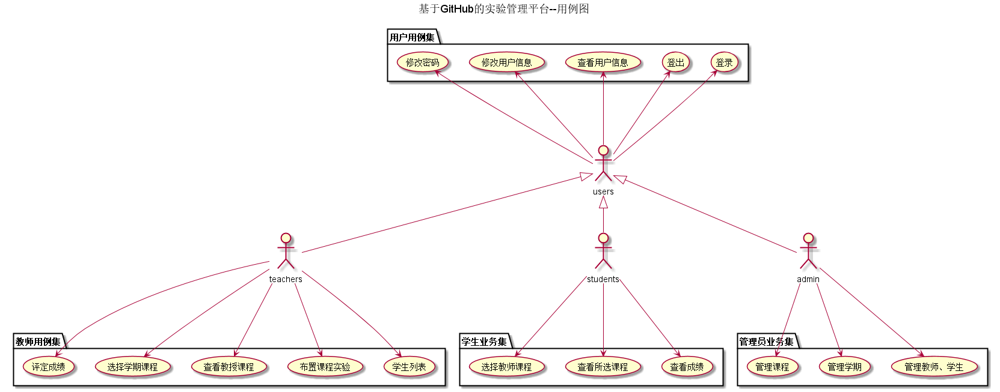
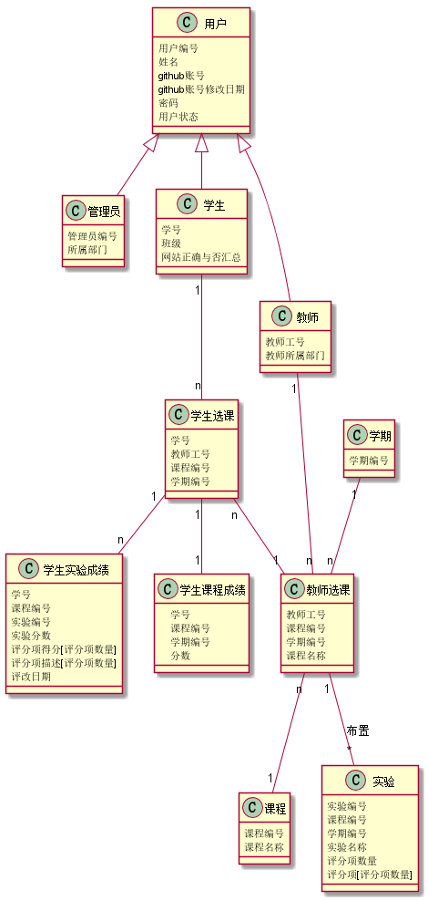

<!-- markdownlint-disable MD033-->
<!-- 禁止MD033类型的警告 https://www.npmjs.com/package/markdownlint -->

# 基于GitHub的实验管理平台的分析与设计

### 成都大学信息科学与工程学院

|学号|班级|姓名|照片|
|:-------:|:-------------: | :----------:|:---:|
|201510414304|软件(本)15-3|胡海龙||

## 1. 概述
- 基于GitHub的实验管理平台的作用是在线管理实验成绩的Web应用系统。学生和老师的实验内容均存放在GitHUB
页面上。
- 学生的功能主要有：一是设置自己的GitHub用户名，二是选择课程，三是查看选择的课程，四是查看课程成绩、实验成绩学生的GitHub用户名是不公开的。
- 老师的功能主要有：一是选择学期课程，二是获取课程学生列表，三是布置课程实验内容，四是批改课程实验。
- 老师能通过本系统的链接方便地跳转到学生的每个GitHUB实验目录，以便批改实验或者查看实验情况。
- 实验成绩按数字分数计算，每项实验的满分为100分，最低为0分。
- 系统自动计算每个学生的所有实验的平均分。
    
## 2. 系统总体结构

界面设计参见：https://hailongcdu.github.io/is_analysis/test6/ui/index.html
    
## 3. 用例图设计 [源码](src/useCase.puml)

## 4. 类图设计 [源码](src/test6calss.puml)

## 5. 数据库设计
- ### [参见数据库设计](./数据库设计.md)

## 6. 用例及界面详细设计
- ### [“教师选课”用例](./用例/教师选课.md),[界面](https://hailongcdu.github.io/is_analysis/test6/ui/教师选课.html)
- ### [“布置实验”用例](./用例/布置实验.md),[界面](https://hailongcdu.github.io/is_analysis/test6/ui/布置实验.html)
- ### [“教师查看所选课程”用例](./用例/教师查看所选课程.md),[界面](https://hailongcdu.github.io/is_analysis/test6/ui/教师查看所选课程.html)
- ### [“评定成绩”用例](./用例/评定成绩.md),[界面](https://hailongcdu.github.io/is_analysis/test6/ui/评定成绩.html)
- ### [“学生选课”用例](./用例/学生选课.md),[界面](https://hailongcdu.github.io/is_analysis/test6/ui/学生选课.html)
- ### [“学生查看课程成绩”用例](./用例/学生查看课程成绩.md),[界面](https://hailongcdu.github.io/is_analysis/test6/ui/学生查看课程成绩.html)
- ### [“学生查看课程实验成绩”用例](./用例/学生查看课程实验成绩.md),[界面](https://hailongcdu.github.io/is_analysis/test6/ui/学生查看课程实验成绩.html)
- ### [“查看用户信息”用例](./用例/查看用户信息.md),[界面](https://hailongcdu.github.io/is_analysis/test6/ui/查看用户信息.html)
- ### [“修改用户信息”用例](./用例/修改用户信息.md),[界面](https://hailongcdu.github.io/is_analysis/test6/ui/修改用户信息.html)
- ### [“学生列表”用例](./用例/学生列表.md),[界面](https://hailongcdu.github.io/is_analysis/test6/ui/学生列表.html)
- ### [“修改密码”用例](./用例/修改密码.md),[界面](https://hailongcdu.github.io/is_analysis/test6/ui/修改密码.html)
- ### [“登出”用例](./用例/登出.md),[界面](https://hailongcdu.github.io/is_analysis/test6/ui/登出.html)
- ### [“登陆”用例](./用例/登陆.md),[界面](https://hailongcdu.github.io/is_analysis/test6/ui/登陆.html)