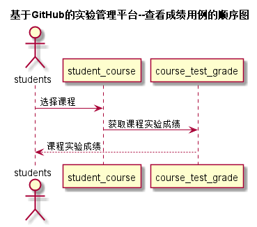

<!-- markdownlint-disable MD033-->
<!-- 禁止MD033类型的警告 https://www.npmjs.com/package/markdownlint -->

# “学生查看课程实验成绩”用例 [返回](../README.md)
## 1. 用例规约

|用例名称|学生查看实验课程成绩|
|-------|:-------------|
|功能|以表形式的显示出学生课程成绩的信息|
|参与者|学生|
|前置条件|学生需要先查看课程|
|后置条件| |
|主事件流| |
|备选事件流| |

## 2. 业务流程（顺序图） [源码](../src/学生查看课程实验成绩.puml)
 

## 3. 界面设计
- 界面参照: https://hailongcdu.github.io/is_analysis/test6/ui/学生查看课程实验成绩.html
- API接口调用
    - 接口1：[getCourse](../接口/获取课程实验成绩.md) 

## 4. 算法描述

无
    
## 5. 参照表

- [学生选课表](../数据库设计.md/#tb_student_course)
- [课程成绩表](../数据库设计.md/#tb_test_grade)
