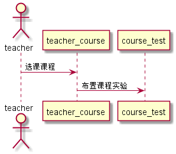

<!-- markdownlint-disable MD033-->
<!-- 禁止MD033类型的警告 https://www.npmjs.com/package/markdownlint -->

# “布置实验”用例 [返回](../README.md)
## 1. 用例规约

|用例名称|布置实验|
|-------|:-------------|
|功能|教师为教授的课程添加实验内容|
|参与者|学生|
|前置条件|教师需先选择课程|
|后置条件| |
|主事件流| 1.教师输出实验内容 2.点击提交添加内容 3.系统记录课程实验|
|备选事件流| 1a.若实验相关内容输入有为空 1.需重新输入才可以提交|

## 2. 业务流程（顺序图） [源码](../src/布置实验.puml)
 

## 3. 界面设计
- 界面参照: https://hailongcdu.github.io/is_analysis/test6/ui/布置实验.html
- API接口调用
    - 接口1：[布置课程实验](../接口/布置实验.md) 

## 4. 算法描述

无
    
## 5. 参照表

- [课程实验表](../数据库设计.md/#tb_test)
- [教师选课表](../数据库设计.md/#tb_teacher_course)