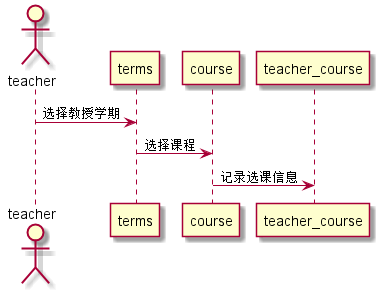

<!-- markdownlint-disable MD033-->
<!-- 禁止MD033类型的警告 https://www.npmjs.com/package/markdownlint -->

# “教师选课”用例 [返回](../README.md)
## 1. 用例规约

|用例名称|教师选课|
|-------|:-------------|
|功能|以列表的形式将可选课程显示出来|
|参与者|教师|
|前置条件|教师需要先登录|
|后置条件| |
|主事件流| |
|备选事件流| |

## 2. 业务流程（顺序图） [源码](../src/教师选课.puml)
 

## 3. 界面设计
- 界面参照: https://hailongcdu.github.io/is_analysis/test6/ui/教师选课.html
- API接口调用
    - 接口1：[教师选课](../接口/教师选课.md) 

## 4. 算法描述

无
    
## 5. 参照表

- [课程表](../数据库设计.md/#tb_course)
- [学期表](../数据库设计.md/#tb_term)
- [教师选课表](../数据库设计.md/#tb_teacher_course)
